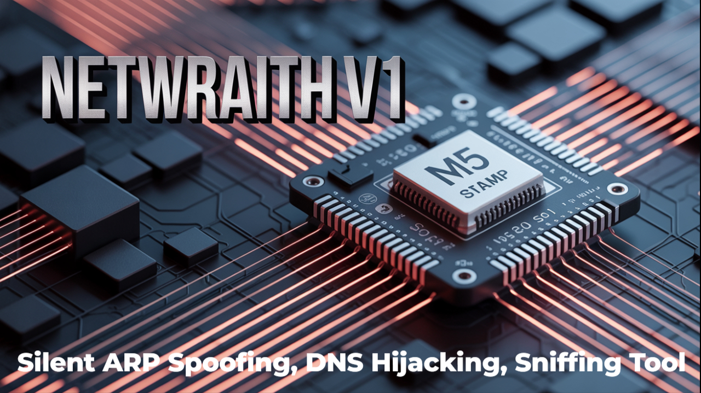

<div align="center">
    

</div>

<div align="center">
  
  <h1> NetWraith</h1>
   
  <p>
    A Silent Intruder - Aggressive spoofing , Hijacking &amp; Sniffing | M5 Stamp S3 | Cybersecurity_Red_Team_Gadget
  </p>


  📫 How to reach me  **http://mrechofi.github.io/Tanjib_portfolio_website/**, **tanjibisham777@gmail.com & tanjibisham888@gmail.com**
</div>
# Description:
  <p>
    NetWraith is a compact red-team gadget built on the M5 Stamp S3 microcontroller, engineered to operate as a completely silent intruder on target networks. It delivers aggressive spoofing, session hijacking, and deep packet sniffing—all in one tiny device—allowing red teamers to covertly intercept, manipulate, and analyze network traffic without raising alarms. With its lightweight design, versatile wireless interfaces, and customizable payload scripts, NetWraith empowers advanced penetration testers to simulate real-world adversaries and uncover hidden vulnerabilities with precision and stealth.
  </p>
  
  # Photo:
   
   

# Components: M5 Stamp S3.
# This is Arduino IDE & Esp IDF Compatible, Esp32 Flasher, esptool.py.
# Installation Process:
  <li>
    Upload the binary files in M5 Stamp S3 using esptool.py or Esp32 Flasher.
    when u use esptool.py then follow this: 
    
        ```bash
          esptool.py --chip esp32 --port COM3 write_flash 0x10000 your_firmware.bin
          
        ```
        - Replace `COM3` with your port, and `your_firmware.bin` with your filename.
    
     OR, you can use Esp32 Flasher.
     now read the 'Note'.
  </li>

 # Note:
    
       - when u upload the .bin file in M5 Stam S3 then , install the putty terminal then plug in M5 Stamp S3 with your pc by USB cable.
          Open putty terminal and add port and baud speed 115200 then click open .
       - Now u will see a CLI based attacks environment. 
       - when u type target ip or information then u will not see what u have typed but u will see the output. this happen cause this terminal is serial port based 
         terminal but it runs smoothly. So do not get hesitate!  
    
         
